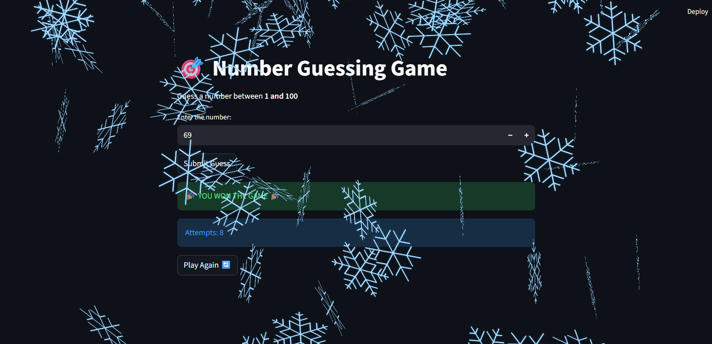
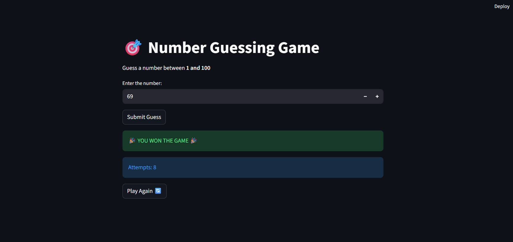

# 🎯 Number Guessing Game

A fun web-based number guessing game built with **Python** and **Streamlit**. The computer picks a secret number between 1 and 100, and you try to guess it using the hints "Too low" and "Too high". Win the game and enjoy the balloons and snow celebration! 🎉




---

## ✨ Features

- Computer picks a random number between **1 and 100**
- Hints after every guess: **Too low ⬇️** or **Too high ⬆️**
- **Attempt counter** shows how many guesses you took
- Celebration effects on winning: 🎈 balloons and ❄️ snow
- **Play Again** button to restart with a new number, with no page reload needed
- Game state is stored with Streamlit's `session_state`, so the number stays the same between guesses

## 🕹️ How to Play

1. Enter a number between 1 and 100.
2. Click **Submit Guess**.
3. Use the hint (Too low / Too high) to adjust your next guess.
4. Keep guessing until you find the secret number.
5. When you win, you'll see your total attempts. Click **Play Again 🔄** to start a new game.

## 🛠️ Tech Stack

| Technology | Purpose |
|------------|---------|
| Python 3 | Game logic |
| Streamlit | Web interface |
| `random` module | Generating the secret number |

## 📁 Project Structure

```
├── streamlitui.py        # Game code
├── requirements.txt      # Dependencies
├── game_win.png          # Screenshot
├── game_snow.png         # Screenshot
└── README.md
```

## 🚀 Getting Started

### 1. Install Streamlit

```bash
pip install -r requirements.txt
```

### 2. Run the game

```bash
streamlit run streamlitui.py
```

The game opens in your browser at `http://localhost:8501`.

## 🧱 How It Works

- On the first load, the app saves a random number, the attempt count and a `game_over` flag in `st.session_state`.
- Each click on **Submit Guess** adds 1 to the attempts and compares your guess with the secret number.
- A correct guess shows the win message, plays `st.balloons()` and `st.snow()`, and sets `game_over = True`.
- **Play Again** generates a new number and resets the attempts and game state.

## 🔮 Future Improvements

- Add difficulty levels (easy, medium, hard) with different number ranges
- Limit the number of attempts
- Add a high score / leaderboard for the fewest attempts
- Show a history of previous guesses
- Deploy online with Streamlit Community Cloud

## 👨‍💻 Author

Made by **<Kamran Shahid>**
GitHub: [@<kamran-077>)

---

⭐ If you enjoyed the game, give this project a star!
